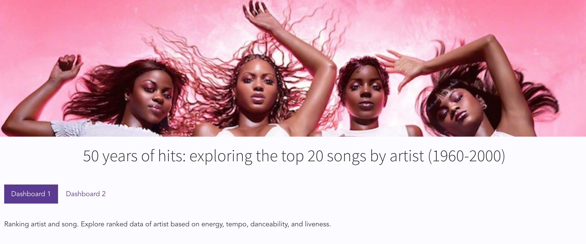
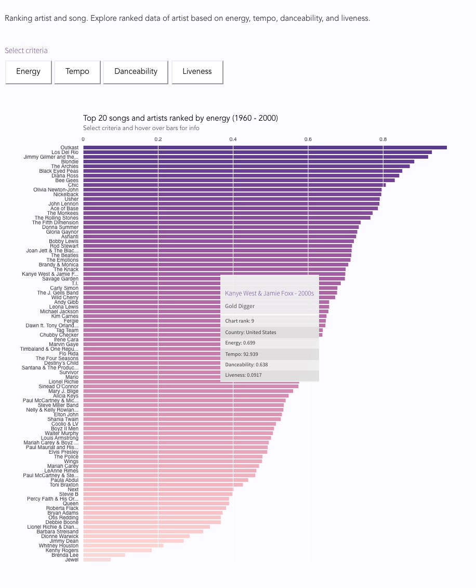
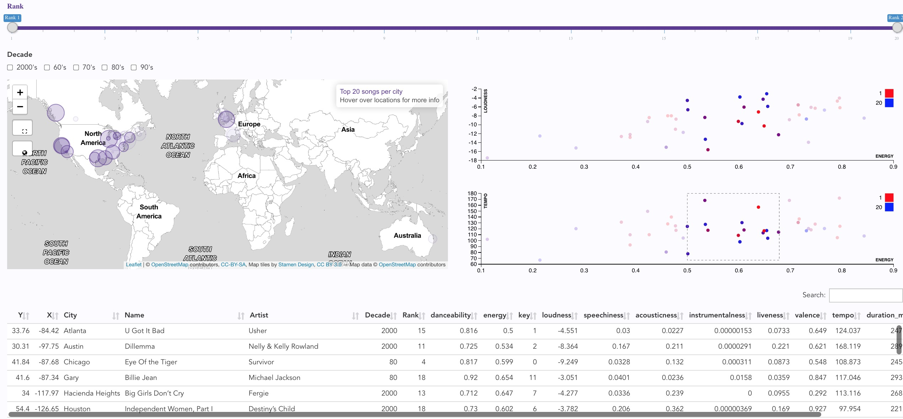

# Celonis Visualization Engineer Challenge  
Matt Malishev | @darwinanddavis         

### Landing page      


<br>  

### Dashboard 1        
    

<br>

### Dashboard 2    
      

### Files  

D3 code and output      
'app.js'      
'index.html'     
'scatter.js'       

Website      
'celonis.html'  

Data  
'songs.json'  

Style     
'css/styles.css'      

# Task 1   
### [Check out live website](https://darwinanddavis.github.io/celonis/celonis.html)        

******    

# Task 2  
### [Check out Dashboard 2](https://darwinanddavis.github.io/celonis/celonis.html)             
If scatterplots don't render:          
:one: Open 'celonis.html' from dir in browser and navigate to Dashboard 2 tab       

******    

# Task 3     
### Option A: Design Creativity        

I extended the exploratory data elements of the dashboard (bar and scatter charts) to include a map that incorporates more relatable and recognizable elements of the dataset. This allows users to connect the inherently abstract components of the data, such as energy, loudness, liveness, with a familiar UX component such as a map that many people are familiar with. This viz options also maintains data integrity without the unnecessary step of compounding the data and creating more variables e.g. converting `energy` * `loudness` into a new metric then possibly needing to correlate this with the current `liveness` index to verify its usefulness as a new variable in the dataset.      

With the map, users can still define the their own data limits, such as `Rank` (slider), `Decade` (checkboxes), and brushing (scatterplots), using the respective interactive components, then pinpoint individual data points in a visual landscape that is instantly recognizable.     

The added summary data at the bottom of the dashboard then allows users to further drill down into the data by interacting with the rows and search box in the table. Once an area of the plots or map have been selected, users can then select single or multiple rows in the table by clicking on each row. This removes the guesswork of finding individual data points in the scatterplots after initially brushing a search window and surpasses more conventional alternatives i.e. using a tooltip in the scatterplot to display individual point info, which still requires randomly switching among individual points in the plots.      

The analysis part for building the map involved querying the city location string (`City`) in the dataset with available databases on world city locations that returned location data (`longitude` and `latitude`). These new location data were then appended to the original dataset and merged with the appropriate columns and rows to correctly link each city string with the corresponding XY for the real location in the map. The same dataset can then be connected to the scatterplots and summary table via the chosen variable (`Rank`). Note that some locations have been doubled and may appear in multiple countries (an easy fix with more time and fine tuning).      

### Extensions    
Possible extensions to dashboard and data viz    
 
**Dashboard 1**      
- Facet bar chart data by decade       
- Highlight user-defined artist/song e.g. search bar input to highlight one artist as bar chart updates      

**Dashboard 2**      
- Group data into different bins (drop down menu)         
- Update scatter charts with user-defined selection of data variables      
- Enable regex and wildcard search string in search bar of table to allow users to search for a broader range of data more quickly           
- Extend popup info from tooltip in map to display alternative info or charts/data viz within popups for each location e.g. hovering on data point in map displays tooltip info while clicking on data point displays a weblink to the artist homepage or a chart exploring a different variable in the data        

******  

### Caveats    
I don't use Angular (yet), so I ignored the build procedure you provided and instead hosted the dashboard on a shareable website. This allowed me to instead focus on the data exploration and data viz components to showcase different dashboard elements.   

******      

### :pig: Troubleshooting      
Run  `live-server` to view index.html (dashboard 1) or celonis.html (website)    
  
```{bash}
npm install -g live-server
live-server # use CTRL + C to end current session    
```

If live server fails to open browser, enter one of the following in normal web browser        
- http://127.0.0.1:8080/           
- localhost:8080/        
 
Live preview of Dashboard 1     
[Dashboard 1](https://darwinanddavis.github.io/celonis/index.html)      

If scatterplots don't render:       
:one: Open 'celonis.html' in browser and navigate to Dashboard 2 tab            

<br>   
<div align="center">
	<h2 style="color:#FF7E7E">Digital footprint</h2>
	<p>
		<!-- <a href="https://github.com/darwinanddavis" target="_blank">
			</a>  -->
		<a href="https://twitter.com/darwinanddavis" target="_blank">
			</a> 
		<a href="https://www.linkedin.com/in/mmalishev" target="_blank">
			</a> 
	</p>
</div>


  